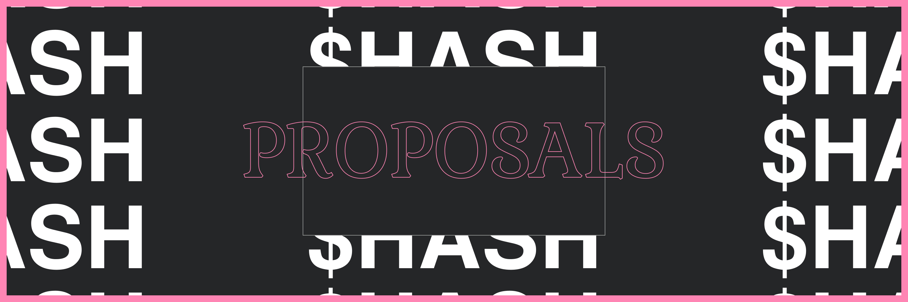

# HCIPs

This is the main canonical repository collecting community thoughts + proposals around improving HASH community.

**POB** (Proof of Beauty Studios) act as an another community member, with the capacity to choose or not to support these proposals as first class features in `pob.studio` or via ETH grants.

HCIPs, $HASH Community Improvement Proposals are generalized improvements to the community. A few examples of possible HCIPs:

- DAOs to govern the quality and accuracy of title + descriptions
- DAOs to curate, archive, and collect history
- Curations of artworks to create a gallery and proposal to fund + develop experiences around them (metaverse museum?) (Physical representations?)
- Grants to build tooling community needs
- Continued proposals to improve how the $HASH community is governed

At our current nascent state, we will be keeping our conversations open-minded and not have any formal process a HCIP must go through.

The only thing we will do: for any HCIPs that has been enacted, we will store it in the repo under `HCIPs` for posterity.

Inspired by [ZEIPs](https://github.com/0xProject/ZEIPs)
